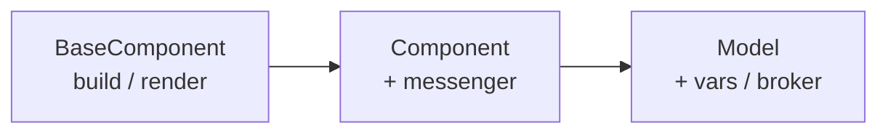

# JAML® Component Layer

The component layer is the engine that parses JAML objects, creates elements, and manages lifecycle, reactivity, and messaging.



Start with `BaseComponent` for pure element building. Upgrade to `Component` for messenger-reactive UIs. Use `Model` as the top-level root of any JAML-rendered UI.

> **See also:** [JAML Format Reference](./jaml-format.md) for control keys and element params. [Binders & Messaging](./binder.md) for the binder syntax and broker system.

---

## Global Entry Points

Three globals are registered at startup:

| Global | Signature                            | Returns                  | Use when                                             |
| ------ | ------------------------------------ | ------------------------ | ---------------------------------------------------- |
| `jaml` | `jaml(container, option)`            | `Model` easyAccess proxy | Render a reactive JAML UI                            |
| `jame` | `jame(option)`                       | `HTMLElement`            | Build a static element — no reactivity, no messaging |
| `jamd` | `jamd(container, markdown, option?)` | `Model`                  | Render a Markdown document                           |

### Core `jaml.*` API

| Method | Description | See |
|---|---|---|
| `jaml(container, option)` | Render a reactive JAML UI | Below |
| `jaml.<type>(...)` | Easy builder for any element type | [Easy Builders](#easy-builders--jamltype) |
| `jaml.json(data)` | Convert any JS object into a component tree | [`jaml.json()`](#jamljson--render-json-as-jaml) |
| `jaml.md(content, option?)` | Parse Markdown into a component option | [`jaml.md()`](#jamlmd--markdown-as-component-option) |
| `jaml.register(name, option)` | Register a custom component (CC) | [Custom Components](#custom-components-cc) |
| `jaml.register(definition)` | Register a complete CC Definition and its variant styles | [CC Definitions](#cc-definitions) |
| `jaml.cc.*(...)` | Build conventional title, subtitle, and indicator nodes for CC Definitions | [CC builders](#cc-builders) |
| `jaml.registerUsage(name, option)` | Register a reusable action preset | [`jaml.registerUsage()`](#jamlregisterusage--custom-usages) |
| `jaml.var(key, cb?)` | JS-first reactive binder builder | [Binder syntax](./binder.md#jamlvar-programmatic-binder) |
| `jaml.bunch(target, builder)` | JS-first loop builder (equivalent of `buildFor`) | [`buildFor`](./jaml-format.md#buildfor) |
| `jaml.res(fn)` | Mark a function as a lazy param resolver | [Element params](./jaml-format.md#jamlres--lazy-param-resolver) |
| `jaml.pre(value)` | Preserve a value from binder evaluation | [Binder syntax](./binder.md#jamlpre--preserve-a-value-from-binding) |

---

## `jaml` — render JAML UI

`jaml(container, option)` is the primary entry point. It parses the JAML option, builds the element tree, renders into `container`, and returns the `Model` instance.

```javascript
const model = jaml('#app', { type: 'container', vars: { title: 'Hello' }, components: [{ type: 'label', cap: '{{title}}' }] });
model.vars.title = 'Updated'; // reactive — updates all bound {{title}} elements
```

`container` accepts an element ID string, a CSS selector, or an `HTMLElement`.

---

<a id="easy-builders--jamltype"></a>

### Easy Builders — `jaml.<type>()`

When writing JAML in JavaScript, use `jaml.<type>()` to build component options without writing the `{ type: '...' }` boilerplate. Arguments are resolved positionally by their JS type:

| Argument type                               | Resolved as            |
| ------------------------------------------- | ---------------------- |
| First primitive (string / number / boolean) | `cap`                  |
| Second primitive                            | `value`                |
| Array of component options                  | `components`           |
| Any other array                             | `data`                 |
| Plain object                                | Merged into the option |

```javascript
jaml.indicator('Score', 100);
// → { type: 'indicator', cap: 'Score', value: 100 }

jaml.input('Age', { rules: { min: 18 }, onvaluechange: () => {} });
// → { type: 'input', cap: 'Age', rules: { min: 18 }, onvaluechange: ... }

jaml.wrapper([jaml.label('A'), jaml.label('B')]);
// → { type: 'wrapper', components: [{ type: 'label', ... }, ...] }

jaml.select('Options', [
    { name: 'One', value: 1 },
    { name: 'Two', value: 2 }
]);
// → { type: 'select', cap: 'Options', data: [...] }
```

**Element specializations** are accessed via a dot:

```javascript
jaml.input.number('Age');
// creates an input-number

jaml.button.cta('Submit', { submitURL: '/api' });
// creates a button-cta
```

```javascript jaml-playground
export default jaml.wrapper(
    {
        styles: ['wrapper.vertical'],
        vars: { code: 'jaml.indicator.number("foo",1234)' }
    },
    [
        jaml.code({ value: '{{code}}', lineWrapping: true }),
        jaml.divider({ value: 'is actually' }),
        jaml.code({
            lineWrapping: true,
            style: 'height:12rem',
            watchers: {
                code(v) {
                    this.value = jam.toEval(v);
                }
            }
        })
    ]
);
```

```javascript jaml-playground
export default jaml.wrapper('New User', { styles: ['layout.autoalign'] }, [
    jaml.input('Name', {
        valueKey: 'name',
        placeholder: 'Enter name',
        rules: { required: true }
    }),
    jaml.input.number('Age', 18, {
        valueKey: 'age',
        rules: { min: 18, max: 99 }
    }),
    jaml.wrapper({ styles: ['layout.flex(gap:1rem)'] }, [jaml.button.cta('Create Account', { submitURL: '/api/users' }), jaml.button('Cancel', { usage: 'cancel' })])
]);
```

`jame` supports the exact same easy-builder syntax but builds the `HTMLElement` directly instead of returning an option object (see [`jame`](#jame--build-elements)).

---

### `jaml.json()` — render JSON as JAML

Converts any JavaScript object or array into a JAML component tree for visual inspection.

```typescript signature
jaml.json(content: Dictionary): ComponentOption
```

The output type depends on the shape of `content`:

| Input shape                                     | Output element                         |
| ----------------------------------------------- | -------------------------------------- |
| Array of uniform row objects / primitive arrays | `table` with grid styles               |
| Array of primitives                             | `tags`                                 |
| Array of mixed objects                          | `wrapper-list` with recursive children |
| Plain object                                    | `wrapper` with recursive children      |
| Markdown-looking string                         | Parsed as Markdown                     |
| Any other primitive                             | `input-textarea` (read-only)           |

Nested objects recurse automatically; adjacent wrappers are separated by dividers. The root container uses the runtime renderer profile `stylize: 'json'` and applies hover and animation styles. See [Theme Stylize](../Theme/stylize.md#renderer-profiles).

```javascript jaml-playground
export default jaml.json({
    name: 'Alice',
    scores: [88, 91, 76],
    friends: {
        bob: {
            score: 95
        },
        charlie: {
            score: 88
        }
    }
});
```

---

### `jaml.md()` — Markdown as component option

Parses a Markdown string and returns a `ComponentOption` (the JAML option object for the document). Use this when you want to embed a Markdown document as a child component inside a larger JAML tree.

```typescript signature
jaml.md(content: string, option?: Partial<MarkdownOption>): ComponentOption
```

```javascript jaml-playground
export default jaml.md(`
# Hello World
## Section 1
This is a section with a list:
- Item 1
- Item 2
- Item 3
`);
```

For a full standalone document rendering use [`jamd`](#jamd--markdown-renderer) instead.

---

## `jame` — build elements

`jame(option)` is `BaseComponent.build(option)` — it builds the element tree and returns the root `HTMLElement` directly. Use it when you need a standalone DOM element to insert manually.

```javascript
const el = jame({ type: 'button', cap: 'Click me' });
document.querySelector('#toolbar').appendChild(el);
```

`jame` supports the same easy-builder syntax as `jaml`:

```javascript
const button = jame.button('Click me');
const input = jame.input.number('Age');
const wrapper = jame.wrapper([jame.label('A'), jame.label('B')]);
```

`jame.json()` and `jame.md()` build the equivalent element from JSON/Markdown:

```javascript
const jsonElement = jame.json({ name: 'Alice', age: 30 }); // builds HTMLElement from JSON
const markdownElement = jame.md('# Title\nContent'); // builds HTMLElement from Markdown
```

> **`jame` builds static elements only.** Because there is no `Model` and no messenger bus, anything that depends on the messaging system is not supported: `vars`, binder strings (`{{key}}`), `watchers`, `valueWatcher`, `stateWatcher`, `dataWatcher`, and `broker` are all silently inert. Use `jaml` whenever reactivity is needed.

---

## `jamd` — Markdown renderer

`jamd(container, markdown, option?)` renders Markdown as a full styled document with optional table-of-contents, section navigation, and code block toolbars.

```typescript signature
// Signature
jamd(container: string | HTMLElement, markdown: string, option?: Partial<MarkdownOption>): Model
jamd(container: string | HTMLElement, components: ComponentOption, option?: Partial<MarkdownOption>): Model
```

When the second argument is a `ComponentOption` instead of a string, it is wrapped in the same Markdown document shell (scrollbar, TOC, etc.) without parsing.

```javascript
jamd(
    '#docs',
    `
# Getting Started

Install the library and write your first JAML:

\`\`\`javascript
jaml('#app', { type: 'button', cap: 'Hello' })
\`\`\`
`
);
```

**`MarkdownOption` fields:**

| Field        | Default    | Description                                    |
| ------------ | ---------- | ---------------------------------------------- |
| `margin`     | `'1rem'`   | Vertical gap between blocks                    |
| `lineBefore` | `'0.5rem'` | Space before each block                        |
| `lineAfter`  | `'0.5rem'` | Space after each block                         |
| `lineHeight` | `1.6`      | Document line height                           |
| `firstLine`  | `''`       | First-line text indent                         |
| `buildToc`   | `false`    | Build a floating TOC from headings             |
| `style`      | `{}`       | Inline CSS object applied to the document root |
| `styles`     | `[]`       | `StyleOption[]` applied to the document root   |

Add `[toc]` anywhere in the Markdown source to enable the TOC automatically.

---

## Custom Components (CC)

A **custom component** (CC) is a named, reusable JAML option template registered under a `type` name. Once registered, `{ type: 'myCC' }` works anywhere in any JAML tree.

### Registering — object form

Pass a plain JAML option object. The registry deep-clones it on every use so each instance is independent.

```javascript
jaml.register('userCard', {
    type: 'card',
    components: [
        { type: 'label', icon: '👤', cap: '{{name}}' },
        { type: 'indicator', cap: 'Score', value: '{{points}}' }
    ]
});
```

### Registering — function factory form

Pass a zero-argument factory function. It is called fresh on every instantiation — useful when the option object must be constructed dynamically or contains references that should not be shared.

```javascript
jaml.register('randomBadge', () => ({
    type: 'badge',
    color: ['red', 'green', 'blue'][Math.floor(Math.random() * 3)]
}));
```

### Merging caller params into a CC

When a CC is used, any extra params on the call site are **deep-merged** into the registered option (arrays are concatenated; `class` values are unioned). This lets callers override or extend the CC without touching the registration:

```javascript
// Registration
jaml.register('pill', { type: 'badge', styles: ['shape.pill'] });

// Usage — caller adds more styles; they are merged with the registered ones
const pill = { type: 'pill', styles: ['color.accent'], cap: 'New' };
// Effective option: { type: 'badge', styles: ['shape.pill', 'color.accent'], cap: 'New' }
```

### Props as reactive aliases

When a CC uses inner vars (e.g. `{{name}}`, `{{points}}`), the caller passes matching `props` keys to bridge from the outer `vars` namespace:

```javascript jaml-playground
jaml.register('userCard', {
    type: 'card',
    components: [
        { type: 'label', icon: '👤', cap: '{{name}}' },
        { type: 'indicator', cap: 'Score', value: '{{points}}' }
    ]
});

export default {
    type: 'container',
    vars: { data: { username: 'Alice', score: 88 } },
    components: [
        {
            type: 'userCard',
            props: {
                // alias: {{name}} inside the CC → {{data.username}} in outer scope
                name: '{{data.username}}',
                points: '{{data.score}}'
            }
        },
        { type: 'input', cap: 'Change Name', value: '{{data.username}}', placeholder: 'Enter new name' },
        { type: 'input-number', cap: 'Change Score', value: '{{data.score}}', placeholder: 'Enter new score' }
    ]
};
```

Inside `userCard`, `{{name}}` behaves identically to `{{data.username}}` in the outer scope. The CC stays completely decoupled from the outer `vars` shape.

> Props with primitive values (`{ foo: 1 }`) are static constants. Props with binder-string values (`{ foo: '{{key}}' }`) create a live alias that forwards reactivity to the named key. The alias target cannot be reassigned after build, but setting the prop value writes through to the aliased `vars` key.

### CC state ownership

A CC should not define its own `vars` or refer to the caller's future `vars` names. The registered CC owns stable internal prop names; each caller decides which outer `vars` those props alias to.

Use `props` for the CC's public inputs and local state handles:

- Static constants: `props: { step: 2 }`
- Reactive aliases: `props: { count: '{{firstCount}}' }`

When nested children need to read or write the CC root props, set `share: true` on the CC root and use `this.shared` from child hooks. This keeps event handlers pointed at the CC contract instead of the root model's `vars`.

Methods defined on the shared root are exposed through its `methods` dictionary. A child can call `this.shared.methods.methodName()` to invoke the nearest shared ancestor method. Non-conflicting method names are also installed directly, so `this.shared.methodName()` remains available as a shorthand.

```javascript jaml-playground
jaml.register('counterControl', {
    type: 'wrapper',
    share: true,
    props: {
        count: 0,
        step: 1
    },
    methods: {
        increment() {
            this.count += this.step;
        }
    },
    styles: ['layout.autoalign'],
    components: [
        {
            type: 'input-number',
            cap: 'Count',
            value: '{{count}}',
            step: '{{step}}'
        },
        {
            type: 'button',
            cap: '+',
            onclick: function () {
                this.shared.methods.increment();
            }
        }
    ]
});

export default {
    type: 'container',
    vars: {
        firstCount: 1,
        secondCount: 10
    },
    components: [
        {
            type: 'counterControl',
            props: {
                count: '{{firstCount}}',
                step: 1
            }
        },
        {
            type: 'counterControl',
            props: {
                count: '{{secondCount}}',
                step: 5
            }
        }
    ]
};
```

In the child button, `this.shared.methods.increment()` invokes the nearest shared CC root's `increment` method. The direct alias `this.shared.increment()` is also available because `increment` does not conflict with an existing element member. That method writes to the root's `count` prop. Because the caller supplied `count: '{{firstCount}}'`, that write updates `vars.firstCount`. Avoid `this.vars.count` inside CC children; `this.vars` is the root model vars proxy and would couple the CC to a concrete outer variable name.

If a prop name collides with a built-in element property, access it explicitly through `this.shared.props.count` instead of the shortcut property.

### CC Definitions

For component-library authoring, `jaml.register()` also accepts a complete CC Definition. It registers the component body and its named style variants atomically and returns a disposable registration handle. A JavaScript default export can also be recognized and rendered as a variant preview by `jam.renderFromString()`.

```typescript
type CCDefinition = {
    type: string;
    desc: string;
    showType: 'indicator' | 'table' | 'chart' | 'list' | 'menu' | 'layout';
    size: [number, number];
    variants: CCVariant[];
    jaml: BaseComponentOption;
    props: Dictionary;
    vars: Dictionary;
    tag?: string;
    number?: number;
    propsDesc?: Dictionary[];
};
```

| Field | Description |
|---|---|
| `type` | camelCase registered component name without underscores |
| `desc` | Human-readable component description |
| `showType` | Preview category |
| `size` | Default preview size as positive `[columns, rows]` factors |
| `variants` | Non-empty array of named presentation variants |
| `jaml` | Component body registered under `type` |
| `props` | Declared public prop shape and default values used by the preview |
| `vars` | Default sample mutable data used by the preview |
| `tag`, `number`, `propsDesc` | Optional catalogue metadata |

Each variant requires `name` and may provide `desc`, `size`, `styles`, `descStyles`, `props`, and `vars`. For previews, variant `props` merge over the definition defaults while variant `vars` replace the default preview vars. Callers of the registered component still pass their own runtime `props` and `vars`. When a multi-variant definition contains a variant named `basic`, its styles become the shared style layer and it is not shown as a separate preview choice. The old top-level `styles` field is invalid; native JAML style descriptors remain under each variant's `styles` field.

Registration adds the `jam-cc` and `jam-cc-type-[showType]` classes to the component root, enables `share`, and uses `ref: 'cc'` when no root ref is supplied. This lets nested handlers access the stable component contract through `this.shared`.

```javascript
const definition = {
    type: 'outputCard',
    desc: 'Output indicator',
    showType: 'indicator',
    size: [2, 1],
    variants: [
        {
            name: 'basic',
            styles: ['size.fullsize']
        },
        {
            name: 'warning',
            desc: 'Warning',
            styles: ['border.primary'],
            props: { color: 'warning' }
        }
    ],
    jaml: {
        type: 'card',
        components: [jaml.cc.title(), jaml.cc.indicator()]
    },
    props: {
        title: 'Output',
        unit: 'MW',
        color: 'primary',
        data: { id: 'output', value: 86 },
        overwrite: {}
    },
    vars: {}
};

const registration = jaml.register(definition);
// registration.dispose() restores the registration that preceded this one.
```

### CC builders

`jaml.cc` exposes small builders for the conventional CC property contract:

| Builder | Output |
|---|---|
| `jaml.cc.title(option?, classOrStyles?, jamlOption?)` | Title `label` bound to `title`, `icon`, and `overwrite` |
| `jaml.cc.subtitle(option?, classOrStyles?, jamlOption?)` | Optional subtitle `label` bound to `hasSubtitle`, `subtitle`, and `overwrite` |
| `jaml.cc.indicator(option?, classOrStyles?, jamlOption?)` | Indicator bound to `data`, formatting fields, `unit`, `color`, and `overwrite` |

The first argument may be a numeric `dataDef` index or an option object with `dataDef`, `capType`, `valueType`, `hasCap`, `hasIcon`, and `hasUnit`. A string second argument contributes classes; an array contributes styles. The final JAML option is merged last for slots, additional styles, event handlers, and other component parameters.

Lower-level helpers are available through `jam` for tooling and custom hosts:

| Method | Purpose |
|---|---|
| `jam.isCCDefinitionCandidate(value)` | Content-first recognition using `jaml` plus a CC marker field |
| `jam.getCCDefinitionIssues(value)` | Return structured validation issues without throwing |
| `jam.validateCCDefinition(value)` | Throw when a strict CC Definition is invalid |
| `jam.isCCDefinition(value)` | Test the complete strict definition contract |
| `jam.prepareCCDefinition(value)` | Normalize and compile a definition without registering it |
| `jam.registerCCDefinition(value)` | Register the component and variant styles and return a disposable handle |
| `jam.buildCCPreview(registration)` | Build the variant-preview JAML option |
| `jam.renderCCDefinition(container, value)` | Register temporarily and render the complete preview |

### Inspecting the registry

`jaml.registry` is the component registry owner. Use it to inspect or programmatically check what is registered:

```javascript
lime.log(Object.keys(jaml.registry.registry)); // ['userCard', 'randomBadge', ...]
jaml.registry.has('userCard'); // → boolean
jaml.registry.entry('userCard'); // → current registered option or factory
```

`jaml.registry.unregister(name, option?)` removes an entry and returns whether removal occurred. When `option` is supplied, it removes the entry only if the current value is the same registration; this prevents an older disposable owner from removing a newer replacement.

---

### Built-in registered components

JAM-UI ships a small built-in component registry. These names can be used directly as the JAML `type` value.

| Type | Description | Props |
|---|---|---|
| `notifycntr` | Notification container that applies `NutmegNotify.config()` before build | — |
| `themepanel` | Theme and color-scheme configuration panel | — |
| `composablebuttons` | Toolbar actions for composable dashboards | `addPageModalPath`, `registerModalPath` |
| `breadcrumb` | Router breadcrumb built from the nearest installed router or `rambutan` | `separator`, `subpath`, `scoped` |
| `dropdown` | Tags-based multi-select control that opens a hidden checkbox menu with `jam.dropDown()` | `value`, `data` |

```javascript jaml-playground
export default {
  type: 'wrapper',
  styles: ['layout.autoalign'],
  components: [
    { type: 'breadcrumb', props: { separator: '/', scoped: false } },
    {
      type: 'dropdown',
      props: {
        value: ['read'],
        data: [
          { name: 'Read', value: 'read' },
          { name: 'Write', value: 'write' }
        ]
      }
    }
  ]
}
```

---

### `jaml.registerUsage()` — custom usages

Register a reusable action preset under a name. Components apply it with the `usage` key. A usage is a partial component option — it can define event handlers (`onclick`, `onmount`), element params, `watchers`, `autoState`, and nested `components`.

```typescript signature
// Signature
jaml.registerUsage(name: string, option: Dictionary | ((...args: any[]) => Dictionary))
```

```javascript jaml-playground
// Register a custom usage
jaml.registerUsage('confirmReset', {
    onclick() {
        const confirmed = confirm('Are you sure?');
        if (confirmed) this.model.resetAll();
    }
});

// Use it
export default {
    type: 'wrapper',
    components: [
        { type: 'input', cap: 'Name', defaultValue: 'John' },
        { type: 'button', cap: 'Reset', usage: 'confirmReset' }
    ]
};
```

Like registered components, usages can be **functions** that accept arguments:

```javascript
jaml.registerUsage('notify', (msg, level = 'info') => ({
    onclick() {
        nutmeg[level](msg);
    }
}));
```

**Built-in usages:**

| Value               | Effect                                                         |
| ------------------- | -------------------------------------------------------------- |
| `"reset"`           | Calls `model.resetAll()` — resets all inputs to `defaultValue` |
| `"clear"`           | Calls `model.clearAll()` — clears all inputs to `null`         |
| `"cancel"`          | Closes the nearest `.jam-closable` ancestor                    |
| `"dateBadge(year?)"`| Formats a date-like value as a date caption plus `HH:mm:ss`; invalid values render empty. `year`: `true`, `false`, or `'auto'` |

**Inspecting the usage registry:**

```javascript
jaml.usageRegistry.has('reset'); // → boolean
Object.keys(jaml.usageRegistry.registry); // ['reset', 'clear', 'cancel', 'dateBadge', ...]
```

---

### `jaml.bunch` with animations

Use `jaml.bunch()` to render a data array with entry animations, parallax hover, and layer effects on each item:

```javascript jaml-playground
jaml.registerCustomColors({
  '220kv': '#800080',
  '110kv': '#F04155',
  '35kv': '#FFFF00',
  '10kv': '#B94842'
});

export default jaml.wrapper(
  {
    styles: ['layout.autogrid(minHeight:15rem)', 'size.fullsize', 'css(padding:1rem;gap:1rem)'],
    vars: {
      items: [
        { name: '220kV', color: '#800080' },
        { name: '110kV', color: '#F04155' },
        { name: '35kV', color: '#FFFF00' },
        { name: '10kV', color: '#B94842' }
      ]
    }
  },
  [
    jaml.bunch('items', (item, idx) => ({
      type: 'indicator',
      icon: ['🏭', '⚡', '💡', '🔧'][idx % 4],
      cap: jam.getColorName(item.color),
      value: item.name,
      unit: 'kV',
      color: item.name,
      styles: [
        'background.crystal',
        'hover.parallax(inward:true)',
        'layer.glare.light',
        'animation.entry.zoom(scale:0.9;delay:random(0,400);duration:random(400,600))'
      ]
    }))
  ]
);
```
