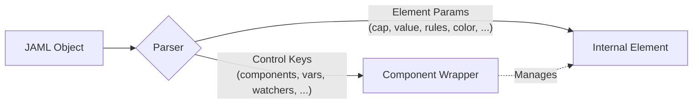

<!-- VERSION: 1.6.0 -->

# JAML® Format Reference

[toc]

A JAML object is a plain JSON object or JavaScript object that describes a UI component. The parser reads it at runtime, creates the element, wires up reactive data, and renders it to the DOM.

> **Key rule:** for element params a `params` wrapper is not necessary. Write them directly as top-level keys alongside JAML control keys. The parser separates them automatically.

---

## Minimal structure

`type` is the only required JAML control key. `cap` is an element param written directly at the top level.

```json
{
    "type": "button",
    "cap": "Click me"
}
```

In a **code-splitting** `.mjs` file, exported default the JAML object:

```javascript
export default {
    type: 'button',
    cap: 'Click me'
};
```

---

### `type`

**Type:** `string`

The element type to create. Maps to a registered JAM-UI element.

```json
[
    { "type": "button" },
    { "type": "indicator" }
]
```

Select an element specialization with a composite type.

```json
[
    { "type": "input-number" },
    { "type": "button-cta" }
]
```

---

## Element params as top-level keys

Any public param (getter/setter) on the element can be written directly as a top-level JAML key. The parser calls `setParams()` which routes them to the element.

```json jaml-playground
{
    "type": "input-number",
    "cap": "Amount",
    "placeholder": "Enter amount",
    "decimalPos": 2,
    "defaultValue": 233,
    "rules": { "min": 0, "max": 1000 },
    "valueKey": "amount"
}
```

No `params: { ... }` wrapper is needed. Public params such as `cap`, `decimalPos`, `defaultValue`, `rules`, and `valueKey` are applied directly.

For structural UI JAML, write `stylize` as a semantic element param when a node has a stable responsibility in app structure, content composition, or interaction. Use roles such as `app`, `header`, `main`, `panel`, `tile`, `section`, `form`, `group`, `field`, `actions`, `list`, and `item` so the active theme can apply automatically. Element types normally supply the framework-owned `element`, `container`, `wrapper`, `input`, `button`, `tag`, `card`, `popup`, and `divider` profiles; see [Theme Stylize](../Theme/stylize.md#large-scale-jaml-authoring).

Use the native `variant` param when the same element and `stylize` role needs an alternate style from the active theme. Use a stable, selector-friendly numeric or descriptive value that names that alternate.

```json
{ "type": "container", "stylize": "list", "variant": "legend" }
```

`variant` emits `jam-variant` for theme selectors. `stylize: "list-legend"` is the compact equivalent of the example above; see [Theme Style Variants](../Theme/theme.md#theme-style-variants).

The `params` key can still be used if you want to group element-specific params separately from JAML control keys — but it is never required.

---

**JavaScript objects**

JAML is not limited to JSON. JavaScript objects, functions, class instances, and computed values are all valid.

```javascript jaml-playground
export default {
    type: 'indicator',
    icon: '🕒',
    cap: 'Now',
    formatter: (v) => new Date(v).toLocaleString(),
    defaultValue: Date.now(),
    styles: [Styles.indicator.bigicon, Styles.hover.highlightcap]
};
```

---

### `jaml.res()` — lazy param resolver

By default, a plain function value in a JAML object is treated as a static value and passed as-is to the element (e.g. `formatter`, `defaultValue`). `jaml.res()` marks a function as a **resolver** — it is not called at parse time but lazily when the param is actually applied to the element.

```typescript signature
jaml.res(fn: Function): Function & { __jam_resolve__: true }
```

Use it when the function body depends on runtime state not available at build time, or to defer an expensive computation until the element is ready.

```javascript jaml-playground
export default {
    type: 'input',
    cap: 'Created At',
    // Invoked at set-time, not at parse time
    defaultValue: jaml.res(() => new Date().toISOString())
};
```

> In JSON, `jaml.res` can be omitted, just use a plain arrow function string like `'() => Date.now()'` directly.

---

> **JS shorthand:** When writing JAML in JavaScript you can use `jaml.<type>()` easy builders, `jaml.register()` for custom components, and the `jame` / `jamd` globals. See [Component Layer](./component.md) for the full API reference.

---

## JAML® control keys

These keys are handled by the component layer, not passed to the element. The parser routes top-level keys either to the Component (control keys) or to the internal Element (params).

> **Binders:** Any string value containing `{{key}}` is a reactive binder — it subscribes to that key in `vars` (or a remote broker) and re-evaluates whenever the value changes. This is how you wire data to the UI. See [Binders & Messaging](./binder.md) for the full binder syntax and broker system.



---

### `vars`

**Type:** `Dictionary`

Root-level reactive data store (Model only). Every key is a reactive variable. Setting `model.vars.key = value` automatically publishes to the messenger and re-renders all bindings.

> **Note:** If `vars` or `broker` is specified, the JAML object will be created as a **model** automatically.

Use the model-level `fkpBlacklist: (string | RegExp)[]` control when selected object paths must be published and replaced as whole values instead of recursively flattened into reactive leaf paths. String entries match an exact dot path; regular expressions may match a path family.

```javascript
export default {
    type: 'container',
    fkpBlacklist: ['settings.editor', /^payload\.raw(?:\.|$)/],
    vars: {
        settings: { editor: { tabSize: 4, wrap: true } },
        payload: { raw: { untouched: true } }
    }
};
```

```javascript jaml-playground
export default {
    type: 'container',
    vars: {
        score: 88,
        user: { name: 'Alice', role: 'admin' }
    },
    components: [
        { type: 'input', cap: 'User', value: '{{user.name}}', placeholder: 'Enter username' },
        { type: 'input', cap: 'Score', value: '{{score}}', placeholder: 'Enter score' }
    ]
};
```

---

### `props`

**Type:** `Dictionary`

Static local constants scoped to this component and its children. Unlike `vars`, **primitive** `props` values are not reactive — they are frozen at build time and never updated afterwards. If a primitive `props` value changes after the component is built, nothing happens.

`props` is best used as a way to **pass named constants down into a component**, similar to function arguments. This is especially useful for registered custom components (CCs): when you define a CC you don't know what `vars` environment it will be used in, so `props` lets the caller pass named values in without the CC needing to know the surrounding `vars` structure.

**Props values have three modes:**

| Prop value type | Example | Behavior |
|---|---|---|
| Primitive (no `{{}}`) | `{ step: 2 }` | Static constant, frozen at build time |
| Single `{{key}}` | `{ name: '{{data.username}}' }` | **Alias** — `{{name}}` in children resolves to `data.username` in `vars`. The prop name refers to the underlying vars key |
| Binder expression | `{ pct: '{{score}} / {{max}} * 100' }` | **Reactive binder** — re-evaluates whenever any referenced key changes |

```javascript jaml-playground
jaml.register('scoreCard', {
    type: 'card',
    components: [
        { type: 'label', icon: '👤', cap: '{{name}}' },
        { type: 'indicator', cap: 'Score', value: '{{points}}' },
        { type: 'progress', cap: 'Percentage', value: '{{pct}}' }
    ]
});

export default {
    type: 'container',
    vars: { data: { username: 'Alice', score: 80, maxScore: 100 } },
    components: [
        {
            type: 'scoreCard',
            props: {
                name: '{{data.username}}',          // alias
                points: '{{data.score}}',            // alias
                pct: '{{data.score}} / {{data.maxScore}} * 100'  // binder expression
            }
        },
        { type: 'input', cap: 'Name', value: '{{data.username}}' },
        { type: 'input-number', cap: 'Score', value: '{{data.score}}' },
        { type: 'input-number', cap: 'Max', value: '{{data.maxScore}}' }
    ]
};
```

`{{name}}` and `{{points}}` alias `data.username` and `data.score`. `{{pct}}` is a derived expression rather than an alias: when `data.score` or `data.maxScore` changes, it re-evaluates and updates the progress bar.

> **Note:** Primitives are static. Single-key placeholders create aliases. Binder expressions are reactive derived values.

---

### `components`

**Type:** `ComponentOption[]`

Array of child JAML objects. Children are rendered inside the parent element in array order.

```json jaml-playground
{
    "type": "wrapper",
    "cap": "My Form",
    "components": [
        { "type": "input", "cap": "Name", "valueKey": "name", "placeholder": "Enter your name" },
        { "type": "button", "cap": "Submit", "submitURL": "/api/submit" }
    ]
}
```

> **Note:** `submitURL` can also be a request option object to control method, headers.

---

### `slot`

**Type:** `string`

Assign a child element to a named slot. JAM-UI elements auto-slot to the parent's default slot — you rarely need this. The main use case is `"slot": "layer"`, which slots the element into the `layer` slot, treating the parent as a container (useful for overlays, spinners, and decorations).

```json
{ "type": "label", "slot": "layer", "cap": "Overlay text" }
```

Other common slots vary by element: `icon`, `cap`, `label`, `extra`, `value`, `content`, `thead`, `option`. If omitted, the element goes to the default slot.

---

### `buildFor`

**Type:** `string`

Render a component once per item in a data collection. Syntax: `"(item, idx) in dataKey"` or `"(item, idx, key) in dataKey"` for objects. The loop names become available as reactive props within the child scope.

```javascript jaml-playground
export default {
    type: 'container',
    vars: { colors: ['red', 'green', 'blue'] },
    components: [
        {
            type: 'wrapper',
            components: [
                {
                    buildFor: '(color, idx) in colors',
                    type: 'badge',
                    cap: '{{idx}}',
                    content: '{{color}}',
                    color: '{{color}}'
                }
            ]
        },
        {
            type: 'button',
            cap: 'Add Color',
            onclick: function () {
                const newColors = ['purple', 'orange', 'cyan', 'pink'];
                this.model.vars.colors.push(newColors[Math.floor(Math.random() * newColors.length)]);
            }
        }
    ]
};
```

**`key` — unique item identifier for arrays:**

Pair `key` to declare how each array item is uniquely identified. `key` accepts a property name string, a binder expression (`"{{item.id}}"`), or a function `(item) => string`. With a `key` defined, the underlying array also supports **access by key** in addition to access by index. Items are matched by their key rather than their position, so insertions, removals, and reorders update the minimal number of components.

> **Key/index collision:** digit-only keys must not fall within the array's valid index range. For a 10-element array (indices `0`–`9`), a key value of e.g. `"5"` would silently resolve to index 5 instead of the keyed element.

```javascript jaml-playground
export default {
    type: 'container',
    vars: {
        users: [
            { id: 'u-1', name: 'Alice' },
            { id: 'u-2', name: 'Bob' },
            { id: 'u-3', name: 'Carol' }
        ]
    },
    components: [
        {
            buildFor: '(user, idx) in users',
            key: 'id',
            type: 'badge',
            cap: '{{user.name}}'
        }
    ]
};
```

`key` can also be a function or a binder expression when the unique value requires computation:

```javascript
// property name (shorthand)
key: 'id';

// binder expression
key: '{{item.country}}-{{item.year}}';

// function
key: (item) => `${item.country}-${item.year}`;
```

**`keyMap` — automatic key inheritance for `buildFor` loops:**

When a `keyMap` is set on the root component (model), child `buildFor` loops automatically inherit the key builder without needing an explicit `key` on each element:

```javascript jaml-playground
export default {
    type: 'wrapper',
    keyMap: {
        users: 'id'  // every "users" loop uses "id" as the key
    },
    vars: {
        users: [{ id: 'a', name: 'Alice' }, { id: 'b', name: 'Bob' }]
    },
    components: [
        {
            buildFor: 'user in users',  // no explicit 'key' — inherits 'id' from keyMap
            type: 'badge',
            cap: '{{user.name}}'
        }
    ]
};
```

`keyMap` entries can be a property name string, a function `(item) => key`, or a `RegExp` key to match multiple loop names patterns. The `keyMap` is accessed via `BaseComponent.keyMap` — a getter that resolves to the root component's map from any child.

**`jaml.bunch()` — JS-first loop builder:**

`jaml.bunch(loopTarget, builder)` is the programmatic equivalent of `buildFor`. Instead of a declarative string + nested component object, you write a builder function that receives `(item, idx, key)` for each element and returns a component option. Use this when the component structure is dynamic or complex enough that a static object template would be unwieldy.

```typescript signature
// Signature
jaml.bunch(loopTarget: string, builder: (item, idx, key) => ComponentOption)
jaml.bunch(loopTarget: string, dedupeKey: string, builder: (item, idx, key) => ComponentOption)
```

```javascript jaml-playground
jaml.register('countryGrid', {
    type: 'wrapper',
    components: [
        jaml.bunch('indis', (item, idx) => ({
            type: 'indicator-number',
            cap: item.label,
            value: item.value,
            color: 'random'
        }))
    ]
});

export default {
    type: 'container',
    vars: {
        data: [
            { label: 'Revenue', value: 12000 },
            { label: 'Cost', value: 8500 },
            { label: 'Profit', value: 3500 }
        ]
    },
    components: [
        {
            type: 'countryGrid',
            props: { indis: '{{data}}' }
        },
        {
            type: 'button',
            cap: 'Add Item',
            onclick: function () {
                this.model.vars.data.push({ label: 'Extra', value: Math.floor(Math.random() * 5000) });
            }
        }
    ]
};
```

Pass an optional `key` string as the second argument to specify the unique item identifier — equivalent to the `key` option on `buildFor`. The same key/index collision rules apply (see above):

```javascript
jaml.bunch('items', 'id', (item) => ({ type: 'card', cap: item.name }));
```

---

### Param suffixes — `[key][Suffix]`

Any element param key ending with a registered suffix is intercepted by the `SuffixRegistry`. The suffix is stripped, and the raw value passes through the suffix's processor function before being set on the element.

**Built-in suffix: `url`** — loads the param value from a remote URL. The response is set directly as that param's value. Works for every param: `dataUrl`, `capURL`, `valueURL`, `iconURL`, `varsURL`, etc.

**Registering custom suffixes** via `jaml.registerSuffix(key, processor)`:

```javascript
// Register a custom suffix that transforms a value before setting
jaml.registerSuffix('ff', (el, key, value) => {
  // el: the element
  // key: the param name with suffix stripped (e.g. 'value' from 'valueff')
  // value: the raw value assigned to the suffixed key
  const result = (value.s * 20 + value.b) / 10000;
  jam.setParam(el, key, result);
});
```

Once registered, any param ending in `ff` triggers the processor:

```javascript
{
  type: 'indicator',
  cap: 'FF Index',
  valueff: { s: '{{salary}}', b: '{{balance}}' }  // → processor runs, sets 'value'
}
```

**Reactive fetching:** Like `vars`, the URL value can contain binders (`{{key}}`). When the referenced variables change, the URL is automatically requested again with the new values, and the element updates.

```json
{
    "type": "select",
    "cap": "City",
    "dataURL": "/api/cities?country={{countryId}}"
}
```

**Special case — `paramsURL`:** The response is treated as a full params object and applied to the element wholesale — equivalent to calling `setParams(response)` on arrival.

```json
{
    "type": "select",
    "cap": "Country",
    "dataURL": "/api/countries"
}
```

```json
{
    "type": "indicator",
    "capURL": "/api/config/title",
    "valueURL": "/api/stats/revenue"
}
```

```json
{
    "type": "input",
    "placeholder": "Enter your email",
    "paramsURL": "/api/form-config/email-field"
}
```

**Reactive vars loading with `varsURL`**

Load initial `vars` from a remote URL. The response object is assigned to `vars` wholesale on arrival. Unlike the inner `[key]URL` shorthand above, `varsURL` replaces the _entire_ vars dictionary when it resolves.

```json
{
    "type": "container",
    "varsURL": "/api/dashboard-data",
    "components": [{ "type": "indicator", "cap": "Revenue", "value": "{{revenue}}" }]
}
```

**Reactive Remote Loading (`vars[key]URL`):**
Any top-level key inside `vars` can be fetched remotely by appending `URL` to the key name. The initial value will be requested from the given URL and automatically placed into the corresponding `vars` key when it arrives.

You can use binder syntax `{{key}}` within these URLs — when the referenced binder keys change, the data is automatically re-fetched. (Be careful not to reference the same key it populates to avoid an infinite loop!)

```javascript jaml-playground
export default {
    type: 'container',
    vars: {
        userId: 123,
        // The object returned by this URL becomes the reactive 'user' variable.
        // Whenever userId changes, the user data will be automatically re-fetched.
        userURL: '/api/users/{{userId}}'
    },
    components: [{ type: 'indicator', cap: 'User Name', value: '{{user.name}}' }]
};
```

The URL value can also be a **request option object** to control method, headers, polling interval, mock fallback, and more:

```javascript jaml-playground
export default {
    type: 'table',
    dataURL: {
        url: '/api/users',
        method: 'POST',
        data: { page: 1, size: 20 },
        headers: { 'X-Token': 'abc' },
        debounce: 300, // debounce rapid re-triggers
        cacheTime: 5000, // cache response for 5s
        transform: (res) => res.list,
        mock: 'mock/users.json', // fallback on 404
        onsuccess(data) {
            nutmeg.success(`Loaded ${data.length} users`);
        },
        onerror(err) {
            nutmeg.error('Failed to load users');
        }
    }
};
```

**Request option fields:**

| Field       | Type               | Description                                                         |
| ----------- | ------------------ | ------------------------------------------------------------------- |
| `url`       | `string`           | Request URL                                                         |
| `method`    | `MethodType`       | HTTP method: `'GET'` (default), `'POST'`, `'PUT'`, `'DELETE'`, etc. |
| `data`      | `any`              | Request body or query params                                        |
| `headers`   | `Dictionary`       | Additional HTTP headers                                             |
| `transform` | `(data) => any`    | Transform the response before applying to the param                 |
| `onsuccess` | `(data) => void`   | Called on success                                                   |
| `onerror`   | `(err) => void`    | Called on error                                                     |
| `onaborted` | `() => void`       | Called when request is aborted                                      |
| `interval`  | `number`           | Polling interval in ms. When set, `cacheTime` is forced to `0`      |
| `debounce`  | `number`           | Debounce delay in ms before sending                                 |
| `cacheTime` | `number`           | Cache response duration in ms (default: ~400ms)                     |
| `mock`      | `string \| object` | Mock URL or object to use as fallback on 404 / network error        |
| `useForm`   | `boolean`          | Serialize `data` as `FormData` (auto-sets method to `POST`)         |
| `urls`      | `array`            | Multiple sequential/parallel requests                               |

---

### `ref`

**Type:** `string`

Name this component so it can be retrieved via `this.model.ref.myName` or `this.model.ref('myName')` inside any element hook.

```javascript jaml-playground
export default {
    type: 'container',
    components: [
        { type: 'input', cap: 'Search', ref: 'searchInput', placeholder: 'Enter keyword here' },
        {
            type: 'button',
            cap: 'Focus',
            onclick: function () {
                // this.model = root model, accessible from any element hook
                this.model.ref.searchInput.focus();
            }
        }
    ]
};
```

> **Note:**
>
> 1. `ref` first searches component's own children, then from the root model.
> 2. You can also use `this.ref` inside any element hook to access the ref map of the owning component.
> 3. If `ref` is not specified, you can ref certain element with its cap.

---

### `share` / `shared`

**Type:** `boolean`

Mark a component as shared so descendant elements can reach its properties via `this.shared` — an upward-looking proxy that finds the nearest ancestor with `share: true`.

```javascript jaml-playground
export default {
    type: 'container',
    vars: { theme: 'dark' },
    components: [
        {
            type: 'wrapper',
            cap: 'Theme Controller',
            share: true, // exposed to descendants
            components: [
                { type: 'switch', cap: 'Dark Mode', value: '{{theme}}' },
                {
                    type: 'wrapper',
                    components: [
                        {
                            type: 'indicator',
                            cap: 'Current Theme',
                            // Access the shared ancestor's cap
                            value: '{{theme}}',
                            state: '{{theme}}',
                            styles: [
                                // Reactive style reading from shared element
                                'css(backgroundColor:{{theme === "dark" ? "#1a1a2e" : "#f0f0f0"}})'
                            ]
                        }
                    ]
                }
            ]
        },
        {
            type: 'button',
            cap: 'Log Shared',
            onclick: function () {
                // this.shared finds nearest share:true ancestor
                const sharedEl = this.shared();
                nutmeg.info(`Shared cap: ${sharedEl.cap}`);
            }
        }
    ]
};
```

`this.shared` is a proxy that also supports property access — reading `this.shared.someProp` walks up the tree to find a shared element that has `someProp` and returns its current value. Setting a property writes back to the shared element. Methods defined on a shared ancestor are available through `this.shared.methods`, so a descendant can call `this.shared.methods.methodName()`. A non-conflicting method name is also installed directly and remains callable as `this.shared.methodName()`.

---

### `showIf`

**Type:** `binder`

Reactive visibility toggle. `false` hides the element via `setHide()` (CSS `display: none` / `jam-hide`). The element stays in the DOM — all binders, watchers, and state remain intact. Supports binder syntax (`{{key}}`) for reactive toggling.

```javascript jaml-playground
export default {
    type: 'container',
    vars: { isAdmin: false },
    components: [
        { type: 'switch', cap: 'Is Admin', valueKey: 'isAdmin' },
        {
            type: 'label',
            cap: 'Admin Panel (Only visible to admins)',
            showIf: '{{isAdmin}}'
        }
    ]
};
```

> **Static vs reactive:** Use `show: true | false` for static visibility. Use `showIf` for reactive toggling. For physically removing the element from the DOM (without destroying it), use [`buildIf`](#buildif).

---

### `buildIf`

**Type:** `binder`

Reactive DOM presence toggle. `false` calls `removeSelf()` — the element is removed from the DOM but **not destroyed**: it stays fully built in memory with all binders, watchers, and state intact. When the value becomes `true`, the element is re-appended to its container via `rerender()`. Supports binder syntax (`{{key}}`) for reactive toggling.

```javascript jaml-playground
export default {
    type: 'container',
    vars: { debugMode: false },
    components: [
        { type: 'switch', cap: 'Debug Mode', valueKey: 'debugMode' },
        {
            type: 'indicator',
            cap: 'Debug Info',
            buildIf: '{{debugMode}}',
            value: 'DebugMode is true'
        }
    ]
};
```

> **Static vs reactive:** Use `build: true | false` for static control. Use `buildIf` for reactive toggling. Unlike [`showIf`](#showif) which hides with CSS (element stays in DOM), `buildIf` physically removes the element from the DOM. Neither destroys the element object or its binders.

---

### `valueKey`

**Type:** `string`

Name this component's value in the model. `model.getFormData()` collects all components with a `valueKey`. If `valueKey` matches a key in `vars`, it creates a two-way binding between the input and that reactive variable.

`valueKey` supports the `@broker` suffix to publish to a different broker:

```json
{
    "type": "input-color",
    "cap": "Accent Color",
    "valueKey": "jam-accolor@milo"
}
```

**Resolution priority:** when the value changes, the system first checks if the key exists in the local model's `vars`. If it does, `vars` is updated directly (short-circuit). Otherwise the value is published to the specified broker. This means a `valueKey` that matches a `vars` key never hits the broker — it stays local.

> **Conflict:** `valueKey` and `value: '{{binder}}'` are mutually exclusive on the same element. Use one or the other.

```json
{
    "type": "input",
    "cap": "Email",
    "placeholder": "Enter your email address",
    "valueKey": "email"
}
```

---

### `usage`

**Type:** `string`

Apply a registered usage, optionally with arguments. Built-in form actions include:

| Value      | Effect                                                         |
| ---------- | -------------------------------------------------------------- |
| `"reset"`  | Calls `model.resetAll()` — resets all inputs to `defaultValue` |
| `"clear"`  | Calls `model.clearAll()` — clears all inputs to `null`         |
| `"cancel"` | Closes the nearest `.jam-closable` ancestor                    |

```javascript jaml-playground
export default {
    type: 'wrapper',
    cap: 'Form',
    styles: ['layout.autoalign'],
    components: [
        { type: 'input', cap: 'Name', defaultValue: 'John Doe', placeholder: 'Enter your name' },
        { type: 'input', cap: 'Email', defaultValue: 'johndoe@example.com', placeholder: 'Enter your email' },
        {
            type: 'wrapper',
            components: [
                { type: 'button', cap: 'Reset', usage: 'reset' },
                { type: 'button', cap: 'Clear', usage: 'clear' },
                { type: 'button', cap: 'Cancel', usage: 'cancel' },
                { type: 'button-cta', cap: 'Submit' }
            ]
        }
    ]
};
```

> **`"reset"` requires `defaultValue`:** `model.resetAll()` only restores inputs that have a `defaultValue` set. If a form has a Reset button, every input needs `defaultValue`.
>
> `usage` is backed by a registry — custom usages can be registered via `jaml.registerUsage()`. See [Component Layer](./component.md#custom-components-cc) for full details.

A registered usage can supply `type`, allowing the caller to omit it. The language server skips type validation when `usage` is present. Table cell usages include `toggleRowDetail(Expand,Fold)`, `toggleRowCheck(button)`, `toggleRowCheck(checkbox)`, `toggleRowChildren`, and `toggleRowChildrenIcon`; they operate on their containing table row.

---

### `methods`

**Type:** `{ [name: string]: Function | string }`

Compile custom methods against the built element and expose them through `element.methods`. When a method name does not conflict with an existing element member, it is also installed directly as `element.methodName()`.

```javascript jaml-playground
export default {
    type: 'label',
    cap: 'hello, jaml!',
    styles: ['text.mono'],
    methods: {
        toggleCase() {
            if (/[A-Z]/.test(this.cap)) {
                this.cap = this.cap.toLowerCase();
            } else {
                this.cap = this.cap.toUpperCase();
            }
        }
    },
    onmouseover() {
        this.methods.toggleCase();
    },
    onmouseout() {
        this.methods.toggleCase();
    }
};
```

---

### `timers`

**Type:** `Array<{ callback: Function, interval: number, fixedRate?: boolean, alignToInterval?: boolean }>`

Start interval timers when the element mounts. Timers are automatically cleared on destroy. Inside the timer callback, `this` is the **element**.

```javascript jaml-playground
export default {
    type: 'indicator',
    cap: 'Time',
    timers: [
        {
            interval: 1000,
            callback: function () {
                // this = the indicator element
                this.value = new Date().toLocaleTimeString();
            }
        }
    ]
};
```

---

### `on`

**Type:** `{ [eventName: string]: Function }`

Attach multiple event listeners at once. Inside all element event callbacks, `this` is the **element**; use `this.model` for the root Model and `this.cmpt` for the immediate component.

```javascript jaml-playground
export default {
    type: 'input',
    cap: 'Search',
    placeholder: 'Enter keywords',
    on: {
        valuechange: function (e) {
            // this = the input element
            nutmeg.info('Search keywords: ' + (this.value || 'empty'), { id: 'search' });
        },
        mount: function () {
            // this.model = root Model
            // this.cmpt  = component that built this element
            nutmeg.orange(`mounted, model:${this.model.id}`, { id: 'search' });
        }
    }
};
```

Individual `on*` hooks (`onclick`, `onvaluechange`, `onmount`, etc.) can also be written as direct top-level keys.

**`once` — one-shot event handlers:** Works identically to `on` but each handler auto-unsubscribes after its first invocation.

```javascript jaml-playground
export default {
    type: 'button',
    cap: 'Click once',
    once: {
        click: function () {
            nutmeg.info('This fires only once!');
        }
    }
};
```

---

### `style`

**Type:** `string | Dictionary`

Native inline CSS applied directly to the element. Use a CSS declaration string or a dictionary with camel-cased property names. Both forms run property-aware token replacement before the declarations are applied, so values such as `padding: 'xs'` and `color: 'subtle'` resolve against the active element tokens. `style` does not resolve JAML style paths; use the plural `styles` param for those.

```javascript jaml-playground
export default {
    type: 'wrapper',
    components: [
        {
            type: 'label',
            cap: 'CSS string',
            style: 'font-size:1.5rem;font-weight:700'
        },
        {
            type: 'label',
            cap: 'CSS dictionary',
            style: {
                fontSize: '1.25rem',
                fontWeight: 600,
                padding: 'xs',
                color: 'subtle'
            }
        }
    ]
};
```

Because `style` writes inline declarations, a scoped state rule such as `hover(...)` cannot override the same property. When the base value needs a state override, put it in the `styles` array with `css(method:rule;...)`; see [State overrides and `method:rule`](../Styles/common/css.md#state-overrides-and-methodrule).

### `styles`

**Type:** `StyleOption[]`

Array of style descriptors applied to the element in order. In JSON, use an array of string paths resolved against the global `Styles` object. In JavaScript, the array can also contain style builder references or results, functions, and `IStyle` values. The leading `Styles.` prefix can be omitted in string paths. Native CSS dictionaries belong in the singular `style` param, not `styles`.

**In JSON** — string paths with optional args:

```json jaml-playground
{
    "type": "indicator",
    "cap": "bigicon",
    "value": 42,
    "icon": "🪐",
    "styles": ["hover.highlightcap", "with(layer)", "layer.scroller.bubbles(scroll:true;sizeRange:[16,32];alphaRange:[0,0.5];blurRange:[0,5];duration:32000)", "layer.scroller.bubbles(scroll:true;sizeRange:[32,48];alphaRange:[0,0.35];blurRange:[5,10];duration:16000)", "layer.scroller.bubbles(scroll:true;sizeRange:[48,64];alphaRange:[0,0.25];blurRange:[10,20];countRange:[5,10],duration:8000)"]
}
```

**In JavaScript (`.mjs`)** — style builders from the `Styles` global:

```javascript jaml-playground
export default {
    type: 'button',
    cap: 'Styled',
    styles: [
        Styles.hover.brighter({ b: 1.05 }),           // with args — call the builder
        Styles.hover.withbg,                            // no args — pass the builder reference directly
        Styles.animation.entry.frombottom({ delay: 100, easing: 'bouncing' })
    ]
};
```

**Two ways to write args:**
- **Inline style string:** `"path.to.style(key1:val1;key2:val2)"` — semicolon-separated, like inline CSS. Supports array values `[a,b,c]`, do not support value that contains parenthesis or semicolon.
- **Literal object string:** `"path.to.style({key1:\"val1\", key2:\"val2\"})"` — JavaScript object literal as a string (parsed at runtime).
- **In JS:** `Styles.path.to.style({ key1: 'val1' })` — real JS object, full type safety.

See [Styles](../Styles/styles.md) for the full reference.

**Scoped style variants:**

Beyond `styles` (which targets the element itself), JAML provides several scoped style params whose selectors are resolved relative to an element. Most target its subtree; dictionary `descStyles` can also target the owning element with `:scope`. All are resolved at mount time and scoped to the component's unique selector so they don't leak.

| Param          | Array value targets                      | Dictionary value                                               |
| -------------- | ---------------------------------------- | -------------------------------------------------------------- |
| `childStyles`  | `:scope > *` — direct children           | Keys are sub-selectors scoped to `element > `                  |
| `descStyles`   | `*` — all descendants                    | Keys are scoped to `element`; `:scope` can match the element itself |
| `optionStyles` | `:scope > .jam-option` — option children | —                                                              |
| `[name]Styles` | CSS selector derived from the key name   | —                                                              |
| `globalStyles` | —                                        | Keys registered globally (no element scope)                    |
| `stateStyles`  | —                                        | Keys are state names; styles applied when that state is active |

**`childStyles`** — styles applied to direct children only:

```javascript
{
    type: 'wrapper',
    // array form: all direct children get the style
    childStyles: ['size.fullsize', 'layout.overflow(hidden)'],
}
```

```javascript
{
    type: 'wrapper',
    // dictionary form: target specific child selectors scoped to `element > `
    childStyles: {
        '.jam-option': ['hover.highlight'],
        'button': ['layout.autoalign']
    }
}
```

**`descStyles`** — array form styles all descendants; dictionary form uses selectors relative to the owning element:

```javascript
{
    type: 'container',
    // array form: all descendants get the style
    // equivalent to `descStyles: { '*': ['text.mono'] }`
    descStyles: ['text.mono'],
}
```

```javascript
{
    type: 'container',
    // dictionary form: target specific descendant types scoped to the element
    descStyles: {
        'wrapper': [Styles.layout.alignlabel],
        '*': [Styles.hover.withbg],
        'table,tags,input': ['animation.entry.frombottom(delay:seq(50,100))']
    }
}
```

Dictionary selectors are relative to the element that owns `descStyles` and pass through `Styles.refineSelector()`. For example, `list-legend > item` resolves to `.jam-list-style[jam-variant="legend"] > .jam-item-style` within that element's scope. Plain selectors match descendants. Use `:scope` when the selector should match the owning element itself:

```javascript
descStyles: {
    ':scope[state=pass]': ['color(green)']
}
```

From an ancestor's `descStyles`, use `indicator[state=pass]` to target matching descendant indicators.

Simple selector refinement is limited to JavaScript selector dictionaries such as `descStyles` and a theme's `index.mjs` `styles` object. Raw CSS/SCSS does not use this grammar; write literal runtime selectors in `index.scss`.

**`[name]Styles`** — any `*Styles` key not in the table above targets the CSS selector derived from its name. The key is lowercased (first letter) and stripped of a leading `desc` and the trailing `Styles` suffix:

```javascript
({
    // "buttonStyles" → targets "button" within the element's scope (elements of JAM-UI)
    buttonStyles: ['layout.autoalign'],

    // "optionStyles" → targets ":scope > .jam-option" (elements with options)
    optionStyles: ['hover.highlight'],

    // ".fooStyles" → targets ".foo" within the element's scope (any custom class)
    '.fooStyles': ['text.bold']
})
```

**`stateStyles`** — map state names to style arrays. Merged into `states` so the styles activate whenever the component transitions to that state:

```javascript
{
    type: 'switch',
    stateStyles: {
        checked: ['css(background-color:rgba(255,255,255,0.2))'],
        disabled: ['css(opacity:0.4)']
    }
}
```

**`globalStyles`** — dictionary form only; keys are registered globally without any element scope, so they apply to every matching element in the document. Use sparingly:

```javascript
{
    type: 'container',
    globalStyles: {
        '.autoalign': ['layout.autoalign'],
        'indicator': [Styles.hover.highlightcap]
    }
}
```

---

### `plugins`

**Type:** `PluginOption[]`

Array of plugin descriptors applied when the element mounts, in order. Each entry is a plugin name string, a full plugin object, or a reference to a built-in plugin.

See [Plugins](../Plugins/plugins.md) for the full list.

```json jaml-playground
{
    "type": "container",
    "plugins": ["shortcut.search(selector:.jam-option)"],
    "components": [
        { "type": "label", "cap": "Which scientist proposed the following theory?" },
        {
            "type": "radio",
            "cap": "The laws of physics are the same for all non-accelerating observers.",
            "styles": ["label.atTop", "options.vertical"],
            "data": [
                { "name": "Albert Einstein", "value": "special_relativity" },
                { "name": "Isaac Newton", "value": "classical_mechanics" },
                { "name": "Niels Bohr", "value": "quantum_model" },
                { "name": "Marie Curie", "value": "radioactivity" }
            ]
        }
    ]
}
```

---

### `cta` / `submitURL`

**Type:** `boolean` / `string`

`cta: true` marks the element with the `jam-cta` class. `submitURL` collects the form data from `getFormData()` and POSTs it to the given URL on click.

**What gets submitted:** every descendant component that has a `valueKey` set contributes its current value. The submitted body is a flat JSON object keyed by `valueKey`.

```javascript jaml-playground
export default {
    type: 'wrapper',
    styles: ['layout.autoalign'],
    cap: 'New User',
    components: [
        { type: 'input', cap: 'Name', valueKey: 'name', placeholder: 'Enter name', rules: { required: true } },
        { type: 'input', cap: 'Email', valueKey: 'email', placeholder: 'Enter email', rules: { required: true, pattern: '^[^@]+@[^@]+\\.[^@]+$' } },
        { type: 'input-number', cap: 'Age', valueKey: 'age', placeholder: 'Enter age', rules: { min: 18, max: 99 } },
        {
            type: 'select',
            cap: 'Role',
            valueKey: 'role',
            defaultValue: 'user',
            data: [
                { name: 'Admin', value: 'admin' },
                { name: 'User', value: 'user' }
            ]
        },
        {
            type: 'wrapper',
            styles: ['size.fullwidth', 'wrapper.buttonwrapper'],
            components: [
                {
                    type: 'button-cta',
                    cap: 'Create Account',
                    submitURL: '/api/users'
                    // Submits: { name: "Alice", email: "alice@example.com", age: 25, role: "admin" }
                },
                { type: 'button', cap: 'cancel', usage: 'cancel' }
            ]
        }
    ]
};
```

The request body sent to `/api/users` will be:

```json
{
    "name": "Alice",
    "email": "alice@example.com",
    "age": 25,
    "role": "admin"
}
```

Validation (`rules`) runs before submission. If any field is invalid, the request is not sent and the failing fields display their error state.

---

### `msgFormat`

**Type:** `{ msgKey: string, valueKeys?: string[] }`

Broadcast collected form data to a message key on click. See [Binders & Messaging](./binder.md#msgformat) for details.

---

### Component Lifecycle Hooks

**Type:** `Function`

Attach callbacks to the component's internal lifecycle. Note that `this` in these hooks refers to the **Component / Model**, not the underlying DOM Element.

-   `onbeforebuild`: Called before the component's element is created.
-   `onafterbuild`: Called immediately after the component's element is created and easy-access properties (`cmpt`, `model`, `props`, `vars`, `shared`, etc.) are installed, before params are applied, attached to the DOM, or children are built.
-   `onbeforerender`: Called just before the component is attached to the DOM.
-   `onafterrender`: Called after the component and all its children are fully attached to the DOM.

```javascript jaml-playground
export default {
    type: 'label',
    cap: 'Lifecycle Demo',
    onbeforebuild: function (option) {
        // this = the Component building this container
        nutmeg.blue('1. Before build');
    },
    onafterbuild: function () {
        // this = the Component
        nutmeg.orange('2. After build');
    },
    onbeforerender: function () {
        // this = the Component
        nutmeg.violet('3. Before render');
    },
    onafterrender: function () {
        // this = the Component
        nutmeg.green('4. Fully rendered and mounted!');
    }
};
```

---

### `watchers`

**Type:** `Watcher[] | { [key: string]: Function }`

Subscribe to reactive data key changes. Supports multi-key watchers, cross-broker keys (`key@broker`), debounce, and one-shot mode. Inside a watcher callback, `this` refers to the **element**. See [Binders & Messaging](./binder.md#watchers) for the full reference.

---

### `valueWatcher` / `stateWatcher` / `dataWatcher`

**Type:** `string`

Shorthand watchers that automatically set the element's `value`, `state`, or `data` when a key changes. Supports the `key@broker` syntax. See [Binders & Messaging](./binder.md#valuewatcher--statewatcher--datawatcher).

---

### `broker`

**Type:** `string | IBroker`

Attach a named message broker to this model for shared reactive state. Built-in brokers include `mango` (in-memory), `milo` (LocalStorage), `miso` (SessionStorage), `mayo` (PostMessage). Supports scoped brokers with `scopeBroker` and `@scope`. See [Binders & Messaging](./binder.md#brokers) for the full reference.

---

### `noBinder`

**Type:** `boolean`

Disable binder evaluation for this component and its descendants. See [Binders & Messaging](./binder.md#nobinder).

---

## `this` context reference

The value of `this` depends on where a callback is written:

| Location                                                                       | `this`                | Notes                                     |
| ------------------------------------------------------------------------------ | --------------------- | ----------------------------------------- |
| `onbeforebuild`, `onafterbuild`, `onbeforerender`, `onafterrender`             | **Component / Model** | Component-level lifecycle hooks           |
| `watchers` callback (on model/root)                                            | **Element**           | Watcher callback is called on the element |
| Element hooks (`onclick`, `onvaluechange`, `onmount`, `timers.callback`, etc.) | **Element**           | The JAM-UI element that fired the hook    |

Easy access of the element's properties:

| Reference    | Points to    | Notes                                          |
| ------------ | ------------ | ---------------------------------------------- |
| `this.cmpt`  | Component    | The component that built this element          |
| `this.model` | Root Model   | Always the root `Model` instance               |
| `this.ref`   | Ref map      | Shortcut to component's `ref` map              |
| `this.vars`  | Vars proxy   | Shortcut to `this.model.vars`                  |
| `this.props` | Props object | The static `props` constants of this component |
| `this.shared`| Shared proxy | Upward-looking proxy for nearest `share: true` ancestor |

**`props` constants on the element:** Every key defined in `props` is also directly accessible as a property on the element itself (i.e. `this.fooBar` in an element hook), as long as the key doesn't conflict with a built-in element param. Avoid reusing names like `icon`, `cap`, `data`, `value`, `content`, `color`, `state`, `disabled`, `type`, `style`, `class`, etc.

```javascript jaml-playground
export default {
    type: 'container',
    vars: { count: 0 },
    components: [
        {
            type: 'button',
            cap: 'Click me',
            props: { step: 2 }, // "step" is not a built-in button param → safe
            onclick: function () {
                // this       = BananaButton element
                // this.cmpt  = the component that built this button
                // this.model = the root Model
                // this.vars  = this.model.vars
                // this.props = { step: 2 }
                // this.step  = 2  (props shortcut, since "step" is not a built-in param)
                this.vars.count += this.step;
            }
        },
        {
            type: 'indicator',
            cap: 'Model Count',
            value: '{{count}}'
        }
    ],
    watchers: {
        count: function (value) {
            // this = the Element
            nutmeg.log(`model count: ${value}`, { id: 'count' });
        }
    }
};
```

---

## Binder syntax

Binders are reactive subscriptions — any string value containing `{{key}}` is automatically evaluated and re-evaluated whenever the referenced key changes. The full binder reference covering variable binders, expression binders, `jaml.var()`, cross-broker binding, compound binder objects, `jaml.pre()`, and `noBinder` has been moved to **[Binders & Messaging](./binder.md)**.
