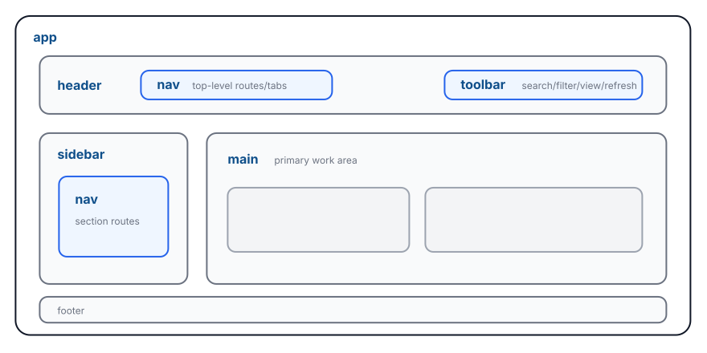
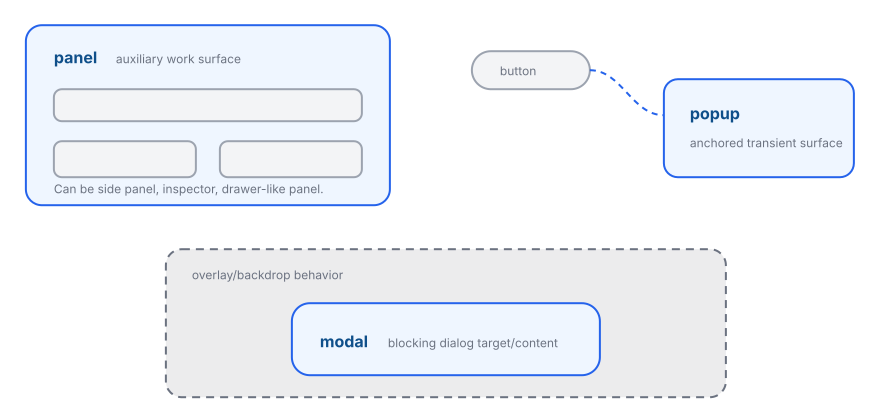
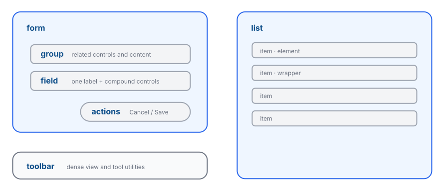
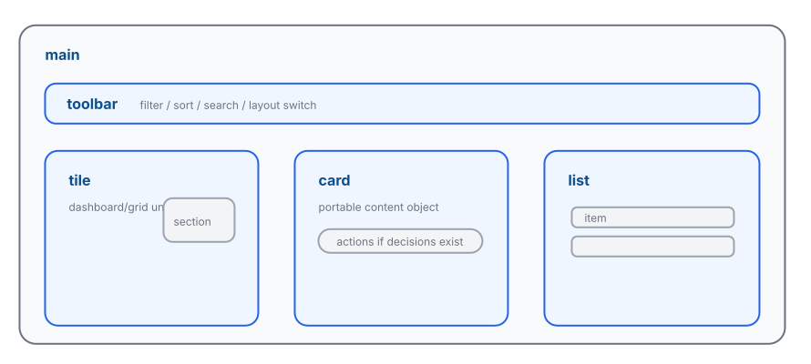

# Stylize Wireframes

These wireframes show the most common `stylize` placements. Use them as naming references before writing theme stylesheets or tokens.

They are intentionally plain. The wireframes decide role names; themes decide visual treatment.

## Common App Shell

Recommended baseline: app > header/sidebar/main/footer. Nav can appear in header or sidebar.



Recommended baseline:

```text
app
  header
    nav
    toolbar
  sidebar
    nav
  main
  footer
```

A normal application has one `app`, one `main`, and zero or one primary `header`, `sidebar`, and `footer` at shell scope.

`main` is the primary work area. `nav` can live in `header`, `sidebar`, `panel`, `main`, or a local tile when tabs switch that tile's content.

In a `header`, use `toolbar` for utility controls such as search, filter, layout switch, refresh, or icon-only tools. Use `actions` only when the group is a decision row, such as Save/Cancel or Publish/Discard.

## Common Surfaces

Surface role names stay stable. Docked, slide-in, floating, movable, and resizable are behavior/recipe choices.



Recommended surface names:

- `panel`: auxiliary work surface for a distinct task or context. It can be docked, slide-in, floating, movable, or resizable.
- `popup`, normally selected by `type: 'popup'`: anchored transient surface, usually triggered by a button, pointer, input, or menu item.
- `modal`: blocking dialog target/content.

The backdrop, focus trap, resize handle, drag handle, slide-in animation, and positioning behavior are stylesheet/plugin/runtime responsibilities. They do not create new core role names.

## Common Workload Blocks

`section` organizes content inside a tile, card, or panel. The remaining workload roles organize related, editable, repeated, or actionable content within that region or workflow.



Recommended workload names:

- `section`: cohesive content region inside a tile, card, or panel. It may be the whole content body and may be named or unnamed.
- `group`: related, same-purpose content or controls. Its children may use different element types, and it may be named or unnamed.
- `form`: one data-editing workflow or data model. Supporting indicators and lists may appear alongside its inputs, and actions are optional.
- `field`: one labelled compound logical value whose controls share help, error, validation, and value ownership.
- `actions`: command row that acts on the current form, modal, panel, or card.
- `toolbar`: dense utility command strip.
- `list`: repeated content container.
- `item`: collection-peer or coordinate-owned child role. It identifies a repeated record in a list and a child positioned by a map or calendar coordinate system. The child may be a concrete element or a wrapper.

`actions` and `toolbar` can both contain buttons. The difference is intent: `toolbar` changes view/tool state; `actions` commits, cancels, deletes, confirms, submits, or otherwise decides.

`group`, `field`, and `actions` own local arrangement and `gap`. `section` owns the cohesive content region. Prefer a flat composition, using nested groups or lists when the content or data itself is hierarchical.

## Common Main Patterns

Use `main` for the primary work area. In a dashboard main, tiles form a flat set of direct children.



Recommended `main` children:

- `toolbar` for view-level controls.
- `tile` for direct dashboard/grid/bento units.
- `type: 'card'` for a portable content object with its own internal structure.
- `list` + `item` for repeated rows/cards/options.

Use `tile` when dashboard placement is part of the node's responsibility. When a portable card is also a dashboard unit, express both on one node with `type: 'card'` and `stylize: 'tile'`. Inside a tile, card, or panel, use `section` for each cohesive content region.

## Additional Compositions

These compositions cover common local responsibilities:

- `header > actions`: page-level Save/Publish/Cancel.
- `panel > nav`: inspector tabs, section switchers, or side-panel route pickers.
- `panel > section`: panel content body or one panel content region.
- `modal > form > actions`: common confirm/edit dialog.
- `popup > actions`: small confirm popups.
- `main > nav`: local tabs, breadcrumbs, section switcher, or table-of-contents inside the main work area.
- `card > actions`: per-card commands.
- `tile > nav`: tile-local tabs that switch its content.
- `tile > toolbar`: tile-local utilities that operate on its current content.
- `tile > section > group`: related controls and indicators within the tile's content body.
- `tile > section > list > item`: repeated content within the tile's content body.
- `map > item`: coordinate-aware labels and overlays within a map.
- `calendar > item`: date-positioned labels, indicators, and marks within a calendar.

Role names express responsibility and placement. Stylesheets, plugins, tokens, and native `variant` express behavior and visual recipes for those roles.
